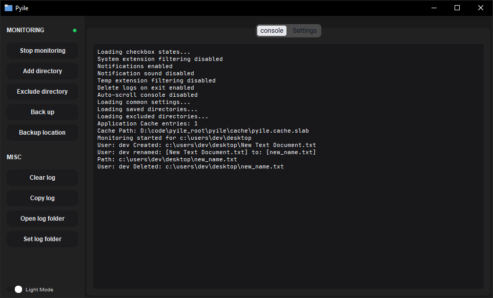
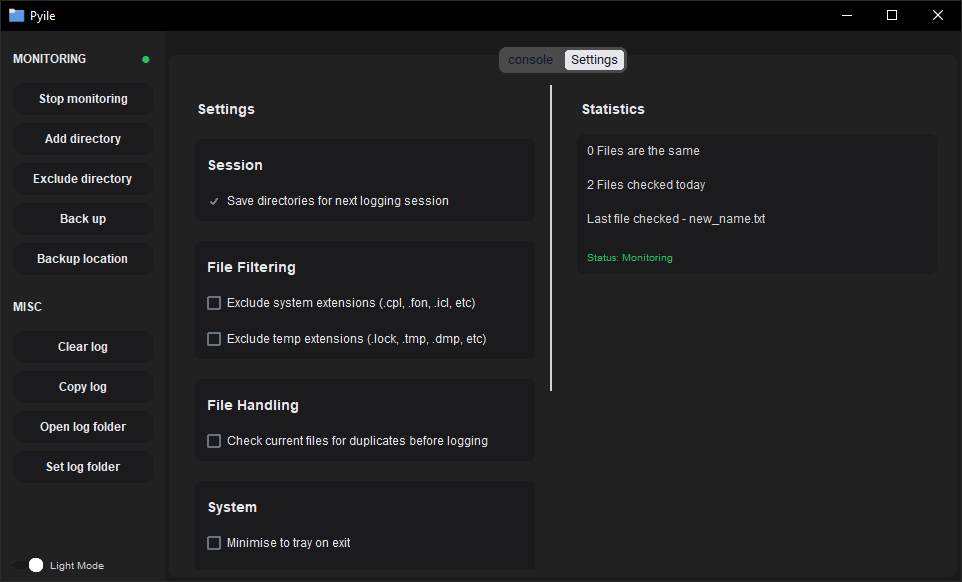
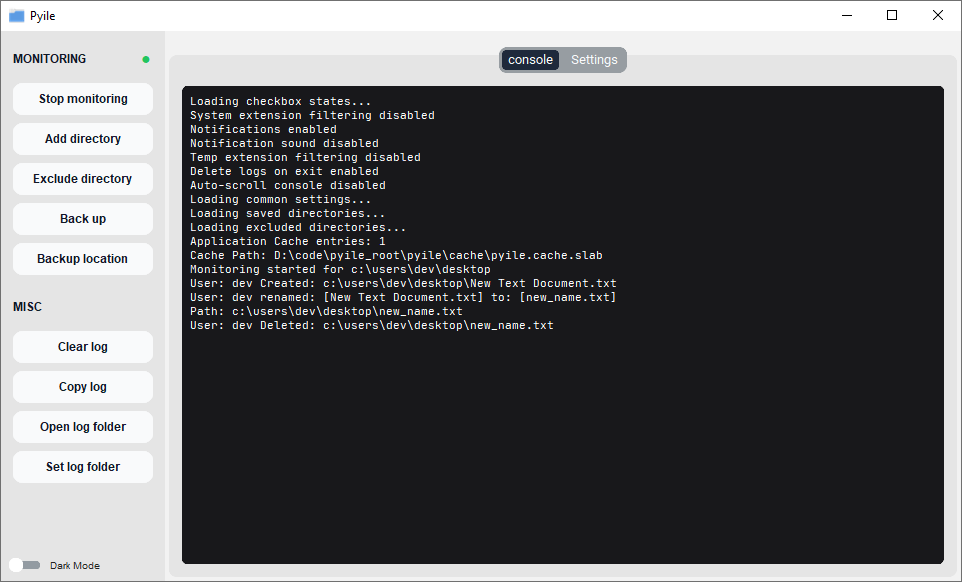
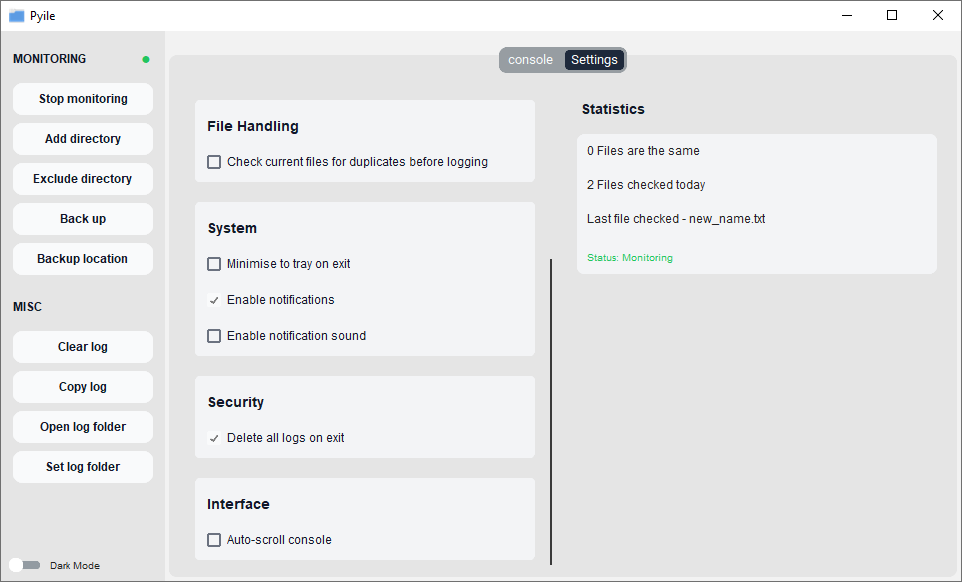

# Pyile

This repository provides a real time file system monitoring tool for Windows, written in Python. Offering deep visibility into file changes, making it ideal for debugging, auditing, and monitoring activity across directories.

> This is a complete rewrite of the original `pyile` project, now archived under the [`pyile_legacy`](https://github.com/0x7f9/pyile_legacy) repository.

##









## Monitoring at the Core

- Supports concurrent monitoring of multiple directories in real time
- Tracks `creation`, `modification` and `deletion` file events
- Each monitored path has its own state tracking for improved performance and isolation  
- Path exclusion filters allow suppression of noisy directories either temp or system files 
- Resolves the user responsible for each file system event detected  
- Designed for accuracy and low latency reporting, even under high event load
- Debounce filtering prevents redundant events during rapid file modifications  

## Duplication Detection

- Optionally scan existing files and compute their content hashes
- All file events are hashed and stored across sessions  
- Hashes are stored in `pyile.cache.slab` after each session 
- Duplicate detection is based on content, not filename or metadata  

## Duplication Detection

- Optionally scan existing files and compute their content hashes
- All file events are hashed and stored across sessions
- Hashes are persisted in `pyile.cache.slab` after each session
- Duplicate detection is based on file content, not filename or metadata
- File modification times `mtime` are used as a fast pre-check to skip hashing unchanged files
- For files smaller than the configured threshold `max_hash_file_bytes`, the entire file is read and hashed
- For larger files, multiple chunks are sampled from the start, middle, and end of the file. These chunks are concatenated and hashed together, improving detection accuracy for changes anywhere within large files

## Smarter Caching

- Combines a memory mapped circular buffer with a fast in memory index
- In memory index `ThreadSafeSet` is used for all read operations
- Backed by a fixed size memory mapped slab file for persistence  
- Cache keys are generated using `xxh3_64` algorithm
- Fully thread safe and consistent under concurrent access
- On startup, the index is rebuilt directly from `pyile.cache.slab` records  
- Append only slab, no iteration or scanning occurs during normal operation  
- Avoids heap allocations during operation and allows for fast cache rebuilding

## Backups Made Easy

> Note: Backup monitoring is not fully integrated yet.

- Trigger file backups at regular intervals (e.g., every 15 minutes)
- Automatic backups trigger by system file event changes
- Performed asynchronously and saved as compressed `.tar.gz` archives.
- Supports manual backup triggers through the interface

## Getting Started

### Requirements

- Windows 10 or 11
- Python 3.10+

### Installation

```bash 
git clone https://github.com/0x7f9/pyile.git
cd pyile_root

# will automatically bootstrap dependencies
# make sure to run `run.py` from the repos root folder
python run.py 
```

### How to Use

1. **Add Folders** – Select directories to monitor from the UI.  
2. **Set Options** – Enable any features you like
3. **Start Monitoring** – Begin or pause monitoring with one click.  
4. **Get Notified** – Stay updated via system notification alerts.
5. **Run Manual Backups** – Click **Back Up**, then select the folder you want to archive.  

### Monitoring Modes

- **File Monitor** – Tracks file changes, resolves usernames, filters by extension, and detects duplicates using content based hashing.  
- **Backup Monitor** – Manages file versioning and archives changes with built in throttling.

## Known Issues

- Notification Sound Timing:
   
   The notification sound currently plays when the legacy notification manager (system tray balloon list) processes the notification, which may not align precisely with the actual toast/banner card appearing visually on screen. To help a fixed 4 second delay is enforced after playing the sound before the next notification sound can trigger. This behavior comes from the legacy `Shell_NotifyIcon` balloon API.

   > Note: I used legacy notification manager to avoid external dependencies such as `winrt`, and the legacy API was easier to implement from scratch.

- Username Context:
   
   Currently the username of the detected file change is grabbed using the `path_filename` of the detected event using `GetSecurityDescriptorOwner()`. This is an issue as it's not actually displaying who deleted the file rather who owned the file. Also for deleted files its falling back to the current user as the file is not on disk. 

   > Note: I am looking into ETW (Event Tracing for Windows) to fix this issue.

## Dependencies

All core dependencies are listed in `pyile/bootstrap/installs.txt`:

- `customtkinter` – Modern GUI framework  
- `darkdetect` – Theme detection  
- `pywin32` – Windows API access  
- `pystray` – System tray integration  
- `pillow` – Image processing used for tray icon  
- `xxhash` – Hashing for content based keys

---

### Features Compared to Legacy Pyile

- **Hashing** – Replaced SHA256 with xxHash for faster duplicate detection  
- **Slab cache** – Added a slab backed cache system that persists between runs 
- **Custom log folder** – Users can now set custom log directory location  
- **Notifications** – Users can now control notification sounds  
- **Modern GUI** – Updated interface and styling
- **DPI awareness** – Proper scaling for high-DPI displays
- **Windows 11 support** – Now fully supports windows 11 environments
- **Security enhancements** – File type validation and secure file opening
- **Thread safety** – Better state management of monitored paths

