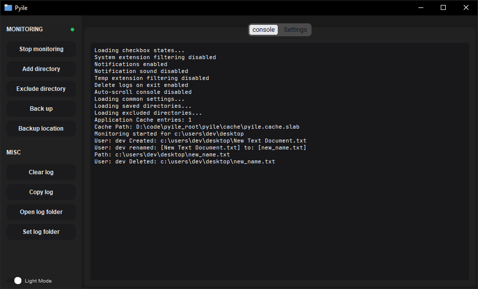
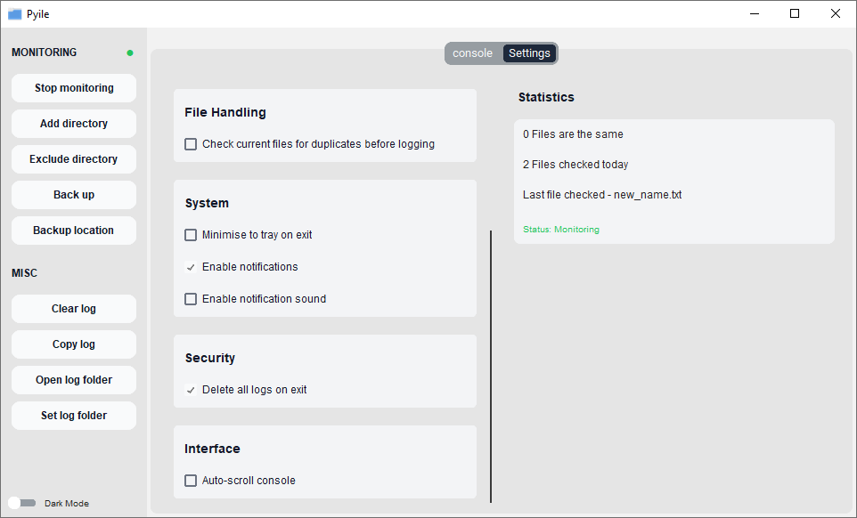

# Pyile

Real time file system monitoring tool for Windows, written in Python. Offering deep visibility into file changes, making it ideal for debugging, auditing, and monitoring activity across directories.





## Monitoring

### Core

- Supports concurrent monitoring of multiple directories in real time.
- Tracks `creation`, `modification` and `deletion` file events.
- Path exclusion filters allow suppression of noisy directories either temp or system files. 
- Resolves the user responsible for each file system event detected.  
- Designed for accuracy and low latency reporting, even under high event load.  
- You can scan existing files and compute their content hashes.
- Duplicate detection is based on file content, not filename or metadata.

### How Caching Between Sessions Works

- Combines a memory mapped circular buffer with a fast in memory index.
- Backed by a fixed size memory mapped slab file for persistence.  
- Cache keys are generated using `xxh3_64` algorithm.
- On startup, the index is rebuilt directly from `pyile.cache.slab` records. 

### How Backup Works

Backup monitoring is not fully integrated yet.

- Trigger file backups at regular intervals (e.g., every 24 hours).
- Automatic backups trigger by system file event changes.
- Saved as a compressed `.tar.gz` archive for storing.
- Supports manual backup triggers through the interface.

## Getting Started

### Requirements

- Windows 10 or 11
- Python 3.10+

### Installation

```bash 
git clone https://github.com/0x7f9/pyile.git
cd into_cloned_folder

# will automatically bootstrap dependencies
# make sure to run `run.py` from the repo root folder
python run.py 
```

## Known Issues

### Notification Sound Timing

The notification sound currently plays when the legacy notification manager (system tray balloon list) processes the notification, which may not align precisely with the actual toast/banner card appearing visually on screen. To help a fixed 4 second delay is enforced after playing the sound before the next notification sound can trigger. This behavior comes from the legacy `Shell_NotifyIcon` balloon API.

### Username Context

Currently the username of the detected file change is grabbed using the `path_filename` of the detected event using `GetSecurityDescriptorOwner()`. This is an issue as it's not actually displaying who deleted the file rather who owned the file. Also for deleted files its falling back to the current user as the file is not on disk. ETW will fix this issue.

### Rapid Start/Stop

When rapidly starting and stopping the monitoring through the GUI, there may be unexpected crashes of the GUI.

## Dependencies

All core dependencies are listed in `pyile/bootstrap/installs.txt`:

- `customtkinter` – Modern GUI framework  
- `darkdetect` – Theme detection  
- `pywin32` – Windows API access  
- `pystray` – System tray integration  
- `pillow` – Image processing used for tray icon  
- `xxhash` – Hashing for content based keys
  
